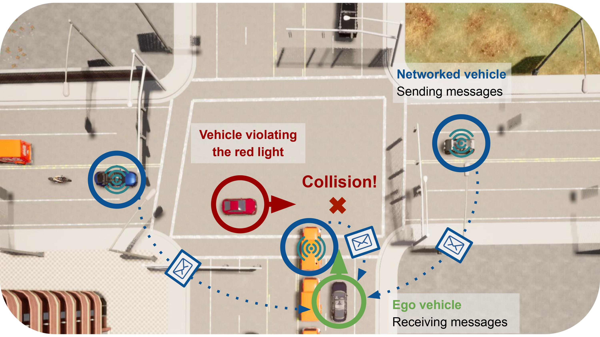
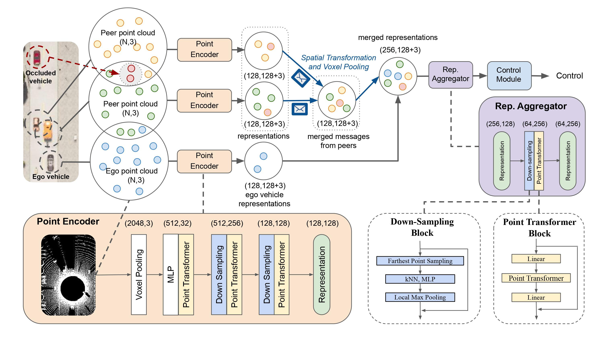
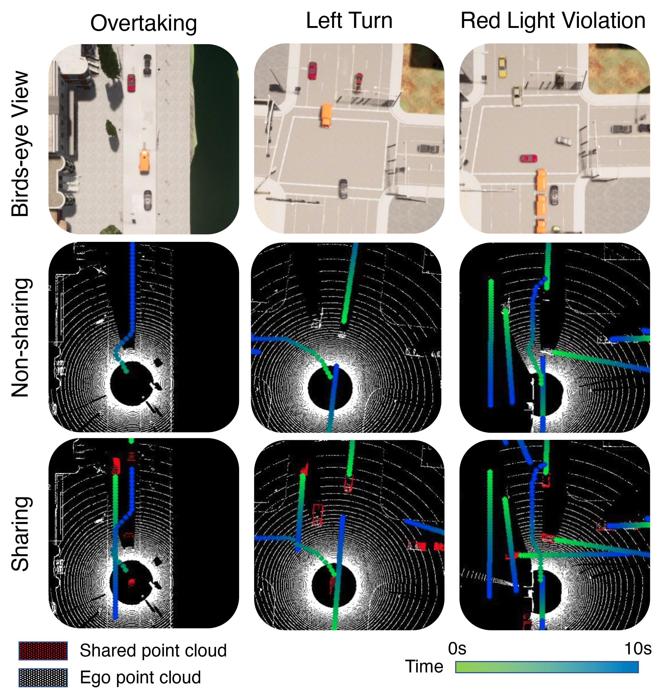
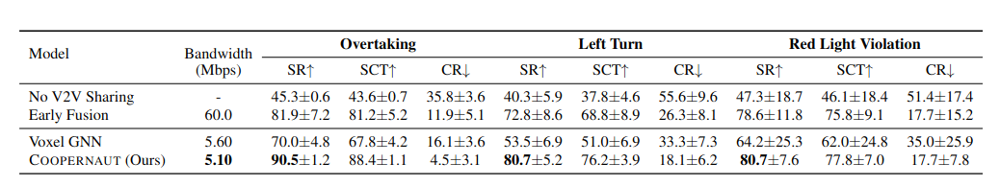
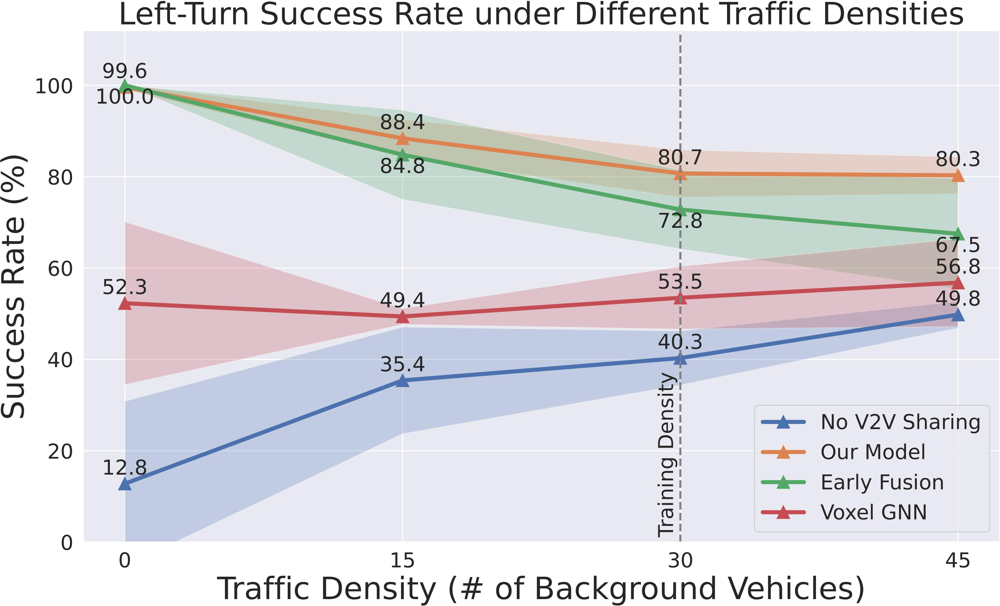

<link href='https://fonts.googleapis.com/css?family=Titillium+Web:400,600,400italic,600italic,300,300italic' rel='stylesheet' type='text/css'>
<head><meta http-equiv="Content-Type" content="text/html; charset=UTF-8">
  <title> Coopernaut: End-to-End Driving with Cooperative Perception for Networked Vehicles</title>

<!-- <meta property="og:image" content="images/teaser_fb.jpg"> -->
<meta property="og:title" content="TITLE">

<!-- Global site tag (gtag.js) - Google Analytics -->

<link media="all" href="./css/glab.css" type="text/css" rel="StyleSheet">

<meta content="MSHTML 6.00.2800.1400" name="GENERATOR"></head>

<body data-gr-c-s-loaded="true">

<h1><strong> Coopernaut: End-to-End Driving with Cooperative Perception for Networked Vehicles</strong></h1>

<h2>
    <a href="https://cuijiaxun.github.io/">Jiaxun Cui*1</a>&nbsp;&nbsp;&nbsp;
    <a href="https://web.stanford.edu/~hangqiu/">Hang Qiu*2</a>&nbsp;&nbsp;&nbsp;
    <a href="https://www.cs.utexas.edu/~dchen/">Dian Chen1</a>&nbsp;&nbsp;&nbsp;
    <a href="https://www.cs.utexas.edu/~pstone/">Peter Stone1,3</a>&nbsp;&nbsp;&nbsp;
    <a href="https://cs.utexas.edu/~yukez">Yuke Zhu1</a>&nbsp;&nbsp;&nbsp;
   </h2>

<h2>
        <a href="https://www.cs.utexas.edu/">1The University of Texas at Austin</a>&nbsp;&nbsp;&nbsp;
        <a href="https://www.stanford.edu/">2Stanford University</a>&nbsp;&nbsp;&nbsp;
        <a href="https://ai.sony/">3Sony AI</a>&nbsp;&nbsp;&nbsp;
</h2>

 CVPR 2022

<h2><a href="">Paper</a> | <a href="https://github.com/UT-Austin-RPL/Coopernaut">Code</a> | <a href="https://utexas.box.com/v/coopernaut-dataset">Dataset</a> | <a href="#bibtex">Bibtex</a> </h2>
 

<!--table border="0" cellspacing="10" cellpadding="0" align="center"> <tbody><tr-->
<!-- For autoplay -->
<!--video controls width="360">
<source src="./src/example.mp4" type="video/mp4">
</video> </tr></tbody></table-->
<table border="0" cellspacing="10" cellpadding="0" align="center"> 
<tbody><tr><td>
</td></tr>
</tbody></table>

<table border="0" cellspacing="10" cellpadding="0" align="center"> 
<tbody><tr><td><left>
Optical sensors and learning algorithms for autonomous vehicles have dramatically advanced in the past few years. 
Nonetheless, the reliability of today's autonomous vehicles is hindered by the limited line-of-sight sensing capability 
and the brittleness of data-driven methods in handling extreme situations. 
With recent developments of telecommunication technologies, cooperative perception with vehicle-to-vehicle 
communications has become a promising paradigm to enhance autonomous driving under dangerous or emergent situations.
</left></td></tr></tbody></table>

<h1 align="center">Coopernaut Overview</h1>
<table border="0" cellspacing="10" cellpadding="0" align="center"> 
<tbody><tr><td>
</td></tr>
<tr><td><left>
We introduce Coopnaut, an end-to-end point-based model that uses cross-vehicle perception for vision-based cooperative driving. Our model encodes LiDAR information into compact point-based representations that can be transmitted. It contains a Point encoder to extract critical information locally for sharing, a Representation Aggregator for merging multi-vehicle messages, and a Control Module to reason the joint messages. The message produced by the encoder has 128 keypoint coordinates and their corresponding features. The message is then spatially transformed into the ego frame. The ego vehicle merges received messages and performs max voxel pooling on the joint representation. Finally, the Aggregator synthesizes the joint representation from all the neighbors as well as the ego vehicle itself before sending them to the Control Module to generate control decisions. The numbers in parentheses specify the data dimensions as messages between vehicles via realistic wireless channels. 
</left>
</td></tr></tbody>
</table>

<h1 align="center">AutoCastSim Environment</h1>
<table border="0" cellspacing="10" cellpadding="0" align="center"> 
<tbody><tr><td>
</td></tr></tbody></table>
<table border="0" cellspacing="10" cellpadding="0" align="center"> 
<tbody><tr><td><left>
We present AutoCastSim, a simulation framework that offers network-augmented autonomous driving simulation on top of CARLA. This simulation framework allows custom designs of various traffic scenarios for training and evaluating autonomous driving models. The simulated vehicles can be configured with realistic wireless communications. It also provides a path planning-based oracle expert who has access to privileged environment information to generate action supervision for imitation learning.
</left>
</td></tr></tbody>
</table>

<h1 align="center">Qualitative Results</h1>

  
<table border="0" cellspacing="10" cellpadding="0" align="center">
  <tbody><tr><td align="center">
  <video muted autoplay loop width="1000" controls>
  <source src="./src/scen10.mov" type="video/mp4">
Your browser does not support the video tag.
</video>
</td></tr>
</tbody>
</table>

<h1 align="center">Quantitative Results</h1>
<table border="0" cellspacing="10" cellpadding="0" align="center"> 
<tbody><tr><td>
</td></tr>
</tbody></table>

  
<table border="0" cellspacing="10" cellpadding="0">
  <tbody>
  <tr><td><left>
We compare Coopernaut with non-V2V and other V2V
driving baselines in AutoCastSim scenarios. 
The evaluation metrics include  success rate (SR), Success weighted by
Completion Time (SCT), and Collision Rate (CR).
Without sharing, the non-V2V model performs poorly with less than 50% success rate (SR) for each scenario
and high collision rates (CR). 
On the other hand, three cooperative driving models, 
including Early Fusion, Voxel GNN, and Coopernaut, have achieved substantially higher SR and SCT
scores and lower collision rates. 
This result indicates that the V2V communication provides
critical information about the traffic situation over the ego
vehicle’s line-of-sight sensing to make more informed driving decisions. 
The Early Fusion method improves over the non-V2V baseline over 30% in average success rate. 
However, it requires transmitting raw point
clouds across vehicles, leading to an unrealistic bandwidth
requirement of 60Mbps (before data compression).
In contrast, both VoxelGNN and Coopernaut pre-processes raw sensory data and perform sensory fusion on the representation level, 
which dramatically reduces the bandwidth requirements while improving driving performances.
Finally, Coopernaut outperforms both Early Fusion and Voxel GNN baselines for all three scenarios. 
The point-based representation learning makes Coopernaut robust to localization errors compared with fusing raw points in Early Fusion. 
The explicit representation of 3D points and their locations, as well as the point sampling module 
retain a high spatial resolution of the intermediate representations in contrast to the voxel-based feature maps used by Voxel GNN.

</left></td></tr>
</tbody>
</table>

<h1 align="center">Sensitivity Analysis</h1>
<table border="0" cellspacing="10" cellpadding="0" align="center"> 
<tbody><tr><td>
</td></tr>
</tbody></table>

<table border="0" cellspacing="10" cellpadding="0" align="center"> 
<tbody><tr><td><left>
We further test Coopernaut under varied traffic densities in the most challenging scenario Left Turn. The figure above shows that our method generalizes to a variable number of traffic densities consistently outperforms the No V2V Sharing baseline. 
In practice, we observe that No V2V Sharing drives slower in denser traffic, thus able to better respond to emergency situations. In contrast, V2V methods do not improve much in dense traffic, as they tend to be impacted by the increased stochasticity of incoming messages from varying neighbors. Nonetheless, Coopernaut still outperforms the baselines in all traffic densities with at least 30% higher success rates over No V2V Sharing.
</left>
</td></tr></tbody>
</table>

<h1 align="center">Citation</h1>
<table id="bibtex" align=center width=1000>
<tr><td><left>
<pre><code style="display:block; overflow-x: auto">
@inproceedings{coopernaut,
 title={Coopernaut: End-to-End Driving with Cooperative Perception for Networked Vehicles},
  author={Jiaxun Cui and Hang Qiu and Dian Chen and Peter Stone and Yuke Zhu},
    booktitle = {Proceedings of the IEEE/CVF Conference on Computer Vision and Pattern Recognition},
    series={CVPR '22},
    month     = {June},
    year      = {2022}
}
</code></pre>
</left></td></tr></table>

<!--
 

<table align=center width=1000px>

<tr><td><left>

<h1>Acknowledgements</h1>

We would like to thank

</left></td></tr></table>

  
-->

<!-- GoStats JavaScript Based Code -->

<noscript></noscript>

<!-- End GoStats JavaScript Based Code -->
<!-- 

</body>
 -->

