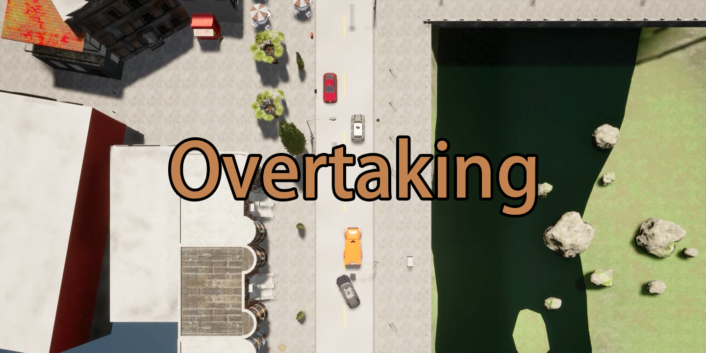
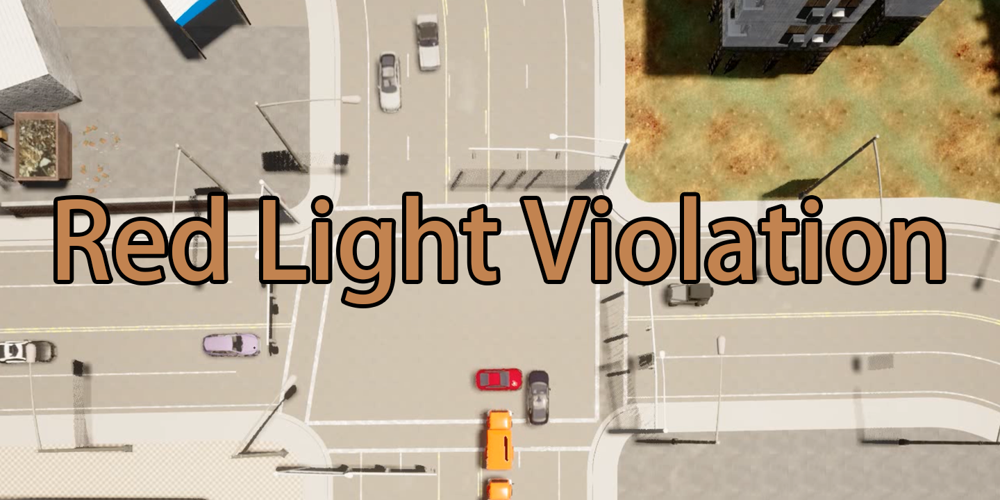

<link href='https://fonts.googleapis.com/css?family=Titillium+Web:400,600,400italic,600italic,300,300italic' rel='stylesheet' type='text/css'>
<head><meta http-equiv="Content-Type" content="text/html; charset=UTF-8">
  <title> Coopernaut: End-to-End Driving with Cooperative Perception for Networked Vehicles</title>

<!-- <meta property="og:image" content="images/teaser_fb.jpg"> -->
<meta property="og:title" content="TITLE">

<!-- Global site tag (gtag.js) - Google Analytics -->

<link media="all" href="./css/glab.css" type="text/css" rel="StyleSheet">

<link media="all" href="./css/slideshow.css" type="text/css" rel="StyleSheet">

<meta content="MSHTML 6.00.2800.1400" name="GENERATOR"></head>

<body data-gr-c-s-loaded="true">

<h1><strong> Coopernaut: End-to-End Driving with Cooperative Perception for Networked Vehicles</strong></h1>

<h2>
    <a href="https://cuijiaxun.github.io/">Jiaxun Cui*1</a>&nbsp;&nbsp;&nbsp;
    <a href="https://web.stanford.edu/~hangqiu/">Hang Qiu*2</a>&nbsp;&nbsp;&nbsp;
    <a href="https://www.cs.utexas.edu/~dchen/">Dian Chen1</a>&nbsp;&nbsp;&nbsp;
    <a href="https://www.cs.utexas.edu/~pstone/">Peter Stone1,3</a>&nbsp;&nbsp;&nbsp;
    <a href="https://cs.utexas.edu/~yukez">Yuke Zhu1</a>&nbsp;&nbsp;&nbsp;
   </h2>

<h2>
        <a href="https://www.cs.utexas.edu/">1The University of Texas at Austin</a>&nbsp;&nbsp;&nbsp;
        <a href="https://www.stanford.edu/">2Stanford University</a>&nbsp;&nbsp;&nbsp;
        <a href="https://ai.sony/">3Sony AI</a>&nbsp;&nbsp;&nbsp;
</h2>

 CVPR 2022

<h2><a href="">Paper</a> | <a href="https://github.com/UT-Austin-RPL/Coopernaut">Code</a> | <a href="#dataset">Dataset</a> | <a href="#bibtex">Bibtex</a> </h2>
 

<!--table border="0" cellspacing="10" cellpadding="0" align="center"> <tbody><tr-->
<!-- For autoplay -->
<!--video controls width="360">
<source src="./src/example.mp4" type="video/mp4">
</video> </tr></tbody></table-->

<!--
<table border="0" cellspacing="10" cellpadding="0" align="center"> 
<tbody><tr><td>
</td></tr>
</tbody></table>
-->

<table border="0" cellspacing="10" cellpadding="0" align="center">
  <tbody><tr><td align="center">
  <video muted autoplay loop width="1000" controls>
  <source src="./src/CoopernautIntro.mp4" type="video/mp4">
Your browser does not support the video tag.
</video>
</td></tr>
</tbody>
</table>

<table border="0" cellspacing="10" cellpadding="0" align="center"> 
<tbody><tr><td><left>
Optical sensors and learning algorithms for autonomous vehicles have dramatically advanced in the past few years. Nonetheless, the reliability of today's autonomous vehicles is hindered by the limited line-of-sight sensing capability and the brittleness of data-driven methods in handling extreme situations. With recent developments of telecommunication technologies, cooperative perception with vehicle-to-vehicle communications has become a promising paradigm to enhance autonomous driving in dangerous or emergency situations. We introduce COOPERNAUT, an end-to-end learning model that uses cross-vehicle perception for vision-based cooperative driving. Our model encodes LiDAR information into compact point-based representations that can be transmitted as messages between vehicles via realistic wireless channels. To evaluate our model, we develop AutoCastSim, a network-augmented driving simulation framework with example accident-prone scenarios. Our experiments on AutoCastSim suggest that our cooperative perception driving models lead to a 40% improvement in average success rate over egocentric driving models in these challenging driving situations and a 5 times smaller bandwidth requirement than prior work V2VNet.
</left></td></tr></tbody></table>

<h1 align="center">Coopernaut Overview</h1>
<table border="0" cellspacing="10" cellpadding="0" align="center"> 
<tbody><tr><td>
</td></tr>
<tr><td><left>
We introduce Coopernaut, an end-to-end point-based model that uses cross-vehicle perception for vision-based cooperative driving. Our model encodes LiDAR information into compact point-based representations that can be transmitted. It contains a Point encoder to extract critical information locally for sharing, a Representation Aggregator for merging multi-vehicle messages, and a Control Module to reason the joint messages. The message produced by the encoder has 128 keypoint coordinates and their corresponding features. The message is then spatially transformed into the ego frame. The ego vehicle merges received messages and performs max voxel pooling on the joint representation. Finally, the Aggregator synthesizes the joint representation from all the neighbors as well as the ego vehicle itself before sending them to the Control Module to generate control decisions. The numbers in parentheses specify the data dimensions as messages between vehicles via realistic wireless channels. 
</left>
</td></tr></tbody>
</table>

<h1 align="center">AutoCastSim Environment</h1>
<table border="0" cellspacing="10" cellpadding="0" align="center">
<tbody>
<tr>
<td align="center">
  <video muted autoplay loop width="327" controls>
  <source src="./src/scenario6-v10.mp4" type="video/mp4">
</video>
</td>

<td align="center">
  <video muted autoplay loop width="327" controls>
  <source src="./src/scenario8-v10.mp4" type="video/mp4">
</video>
</td>

<td align="center">
  <video muted autoplay loop width="327" controls>
  <source src="./src/scenario10-v10.mp4" type="video/mp4">
</video>
</td>
</tr>
<tr>
<td align="center"><b>Overtaking</b></td>
<td align="center"><b>Left Turn</b></td>
<td align="center"><b>Red Light Violation</b></td>
</tr>
</tbody>
</table>

<table border="0" cellspacing="10" cellpadding="0" align="center"> 
<tbody><tr><td><left>
We present AutoCastSim, a simulation framework that offers network-augmented autonomous driving simulation on top of CARLA. This simulation framework allows custom designs of various traffic scenarios for training and evaluating autonomous driving models. The simulated vehicles can be configured with realistic wireless communications. It also provides a path planning-based oracle expert who has access to privileged environment information to generate action supervision for imitation learning.
</left>
</td></tr></tbody>
</table>

<h1 align="center">Qualitative Results</h1>
<table border="0" cellspacing="10" cellpadding="0" align="center"> 
<tbody><tr><td><left>
We provide a qualitative side-to-side comparison between the <b>No V2V Sharing</b> model, which learns control based on the ego lidar view, and <b>Coopernaut</b>, our proposed model that make decisions based on the joint representations of ego perception and neighbor perception. Please click on the thumbnails to switch to a specific scenarios.
</left></td></tr></tbody>
</table>

<table border="0" cellspacing="10" cellpadding="0" align="center"> 
<tbody><tr><td>
<!-- Container for the image gallery -->

  <!-- Full-width images with number text -->
  

    
1 / 3

    <video muted autoplay loop width="1020" controls>
    <source src="./src/qualitative6-v9.mp4" type="video/mp4">
    </video>
  

  

    
2 / 3

    <video muted autoplay loop width="1020" controls>
    <source src="./src/qualitative8-v9.mp4" type="video/mp4">
    </video>
  

  

    
3 / 3

    <video muted autoplay loop width="1020" controls>
    <source src="./src/qualitative10-v9.mp4" type="video/mp4">
    </video>
  

  <!-- Next and previous buttons -->
  <a class="prev" onclick="plusSlides(-1)">&#10094;</a>
  <a class="next" onclick="plusSlides(1)">&#10095;</a>

  <!-- Image text -->
  

    

  

  <!-- Thumbnail images -->
  

    

      Scenario 6: Overtaking.</b>
      The controlled ego car is going to make lanechange maneuver at the two-way yellow-dashed road when a truck is stuck in front of it. Our model avoids collisions by acting less aggresively and properly yielding to the opposite-going vehicles.">
    

    
    

      Scenario 8: Left Turn.</b>
      The red car is going straight in the opposite direction, occluded behind the orange truck. Our model avoids the collisions by properly yielding to the red car before left turning even with the partially observable situation.">
    

    
    

      Scenario 10: Red Light Violation.</b>
      The controlled vehicle is going straight to pass an intersection on green lights. Coopernaut identifies the abnormal behaviors of the collider(red car), and proactively hard brakes to avoid the potential collision.">
    

  

</td></tr></tbody>
</table>

<h1 id=dataset align="center"> Dataset <a href="https://utexas.box.com/v/coopernaut-dataset"> [Download]</a>
</h1>
<table border="0" cellspacing="10" cellpadding="0" align="center">
<tbody>
<tr>
<td align="center">
  <video muted autoplay loop width="333" controls>
  <source src="./src/Scen6.mov" type="video/mp4">
</video>
</td>

<td align="center">
  <video muted autoplay loop width="333" controls>
  <source src="./src/Scen8.mov" type="video/mp4">
</video>
</td>

<td align="center">
  <video muted autoplay loop width="333" controls>
  <source src="./src/Scen10.mov" type="video/mp4">
</video>
</td>
</tr>
<tr>
<td align="center"><b>Overtaking</b></td>
<td align="center"><b>Left Turn</b></td>
<td align="center"><b>Red Light Violation</b></td>
</tr>
</tbody>
</table>

<table border="0" cellspacing="10" cellpadding="0" align="center"> 
<tbody><tr><td><left>
We provide a kick-start dataset for the behavior cloning training, and you can download the dataset 
<a href="https://utexas.box.com/v/coopernaut-dataset"> Here </a>. Alternatively, you can collect your own dataset by running data-collection scripts provided in the public GitHub repository<a href="https://github.com/UT-Austin-RPL/Coopernaut"> Coopernaut </a>. The kick-start dataset contains 3 scenarios, and each has a Train set and a Validation set. The Train set of a scenario typically includes 12 trajectories in total, with 3 of them are accident-proning and 9 of them are normal driving trajectories.
 
Here is a glimpse on the structure of data storage.

<ul class="dashed">
    <li><b> AutoCast_6 </b> The Overtaking Scenario <ul>
        <li><b> Train </b> (Train Set)<ul>    
            <li><b> 0 </b> (Trajectory id) <ul>
                <li><b> RouteScenario_02022-01-12-23-00-10.txt </b></li> The txt file accompanied with the data is a summary of the agent's performance in the specific trajectory, e.g. RouteCompletion, Collisions, InRoute, Duration, Stagnation(ActorSpeedAboveThreshold).
                <li><b> episode_00000 </b><ul>
                This folder contains the sensor data and decision data, with the name of them representing the frame id.
                <li><b> config.json </b></li> This file contains environment and agent configurations for the trajectory.
                <li><b> measurements </b></li> The folder is a list of frame-specific meta data in the environment. For example, the ego speed, ego control, ego and other vehicles' locations, and planned trajectories by expert(if any).
                <li><b> *_RGB </b></li> Bird's Eye View.
                <li><b> *_LIDAR </b></li> The *.npy files are the ego-centric LiDAR point clouds without any communicated points. <b>Note:</b> the z-axis of points are flipped when data logging, so please use -z during training.
                <li><b> *_FusedLIDAR </b></li> The *.npy files are a list of ego-centric <b>fused</b> LiDAR point clouds by AutoCastSim. We do not provide these data as they are not used by any of our baselines or proposed methods. 
                </ul></li>
            </ul></li>

            <li><b> 1 </b></li>
            <li><b> 2 </b></li>
            <li><b> ... </b></li>
        </ul></li>
        <li><b> Val </b> (Validation Set) </li>
    </ul></li>
</ul>

</left>
</td></tr></tbody>
</table>

<!--

<h1 align="center">Qualitative Results</h1>

  
<table border="0" cellspacing="10" cellpadding="0" align="center">
  <tbody><tr><td align="center">
  <video muted autoplay loop width="1000" controls>
  <source src="./src/qualitative6-v8.mp4" type="video/mp4">
</video>
</td></tr>
</tbody>
</table>
-->
<!--

<h1 align="center">Quantitative Results</h1>
<table border="0" cellspacing="10" cellpadding="0" align="center"> 
<tbody><tr><td>
</td></tr>
</tbody></table>

  
<table border="0" cellspacing="10" cellpadding="0">
  <tbody>
  <tr><td><left>
We compare Coopernaut with non-V2V and other V2V
driving baselines in AutoCastSim scenarios. 
The evaluation metrics include  success rate (SR), Success weighted by
Completion Time (SCT), and Collision Rate (CR).
Without sharing, the non-V2V model performs poorly with less than 50% success rate (SR) for each scenario
and high collision rates (CR). 
On the other hand, three cooperative driving models, 
including Early Fusion, Voxel GNN, and Coopernaut, have achieved substantially higher SR and SCT
scores and lower collision rates. 
This result indicates that the V2V communication provides
critical information about the traffic situation over the ego
vehicle’s line-of-sight sensing to make more informed driving decisions. 
The Early Fusion method improves over the non-V2V baseline over 30% in average success rate. 
However, it requires transmitting raw point
clouds across vehicles, leading to an unrealistic bandwidth
requirement of 60Mbps (before data compression).
In contrast, both VoxelGNN and Coopernaut pre-processes raw sensory data and perform sensory fusion on the representation level, 
which dramatically reduces the bandwidth requirements while improving driving performances.
Finally, Coopernaut outperforms both Early Fusion and Voxel GNN baselines for all three scenarios. 
The point-based representation learning makes Coopernaut robust to localization errors compared with fusing raw points in Early Fusion. 
The explicit representation of 3D points and their locations, as well as the point sampling module 
retain a high spatial resolution of the intermediate representations in contrast to the voxel-based feature maps used by Voxel GNN.

</left></td></tr>
</tbody>
</table>
-->

<h1 id="bibtex" align="center">Citation</h1>
<table border="0" cellspacing="10" cellpadding="0" align="center"> 
<tr><td><left>
If you are interested in citing AutoCastSim or Coopernaut in your work, we encourage you to use the following bibtex:
<pre><code style="display:block; width:1000px; overflow-x: auto">@inproceedings{coopernaut,
    title = {Coopernaut: End-to-End Driving with Cooperative Perception for Networked Vehicles},
    author = {Jiaxun Cui and Hang Qiu and Dian Chen and Peter Stone and Yuke Zhu},
    booktitle = {IEEE/CVF Conference on Computer Vision and Pattern Recognition (CVPR)},
    year = {2022}
}
</code></pre>
</left></td></tr></table>

<!--
 

<table align=center width=1000px>

<tr><td><left>

<h1>Acknowledgements</h1>

We would like to thank

</left></td></tr></table>

  
-->

<!-- GoStats JavaScript Based Code -->

<noscript></noscript>

<!-- End GoStats JavaScript Based Code -->
<!-- 

</body>
 -->

